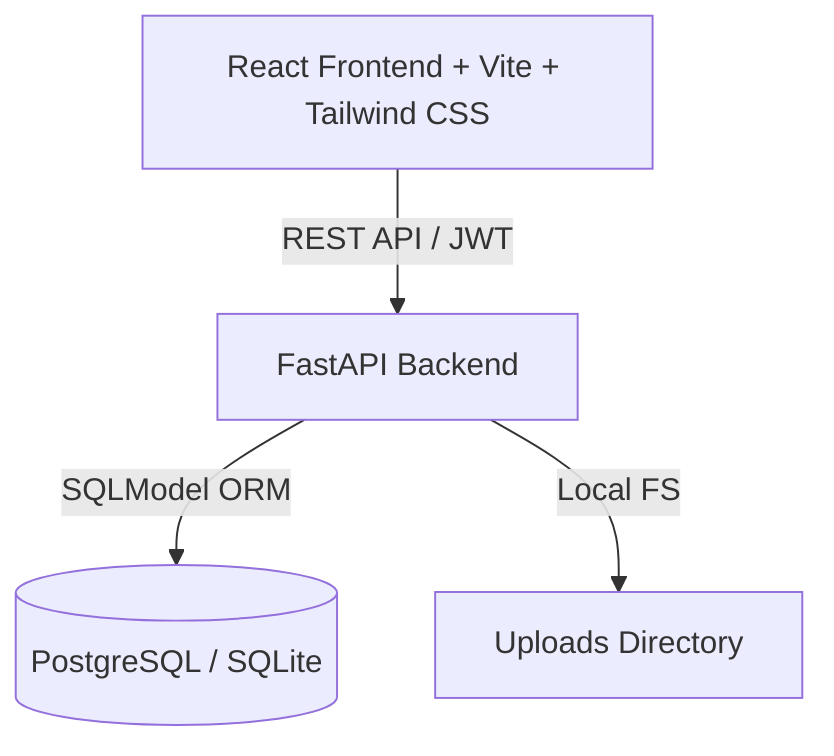
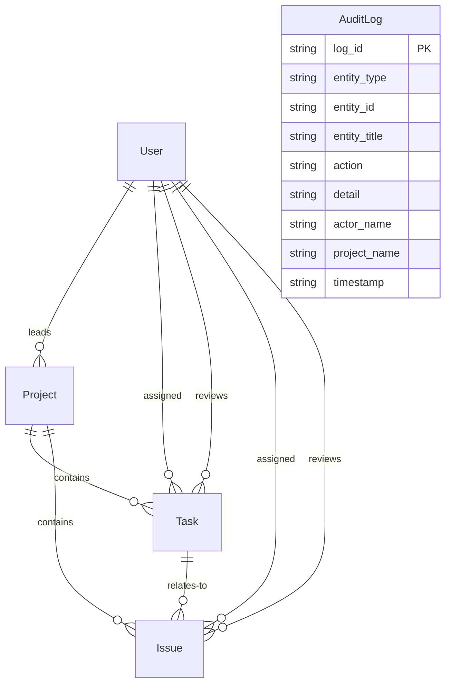

# Task Management System - Documentation

## Project Overview

A comprehensive task management system designed for Data Managers to track multiple concurrent data provision projects across different platforms. The system replaces manual weekly reporting with a centralized tool enabling real-time progress monitoring across three user roles: Operator, Leader, and Manager.

---

## 1. Functional Requirements

### 1.1 Core Entities Management

#### 1.1.1 Project Management (UC-01)

**Primary Actor:** Manager

**Capabilities:**

- Create, Read, Update, Delete (CRUD) operations for projects.
- Assign Leaders to projects.
- View project overview, task counts, issue counts, and SLA status.
- Delete projects only when no open tasks exist (tasks that are in any status other than "Approved" or "Rejected"). Deleting a project cascades to delete all its associated tasks and issues.

**Data Fields:**

- Project ID (PK, autogenerated string)
- Project code (unique, indexed)
- Project name, description
- Start date, end date
- Leader ID (referencing a User with the "Leader" role)
- Project status ("Active" | "Completed" | "On Hold" etc.)
- SLA Target (days allowed between task creation and approval)
- Created at, updated at

#### 1.1.2 Task Management (UC-02)

**Primary Actor:** Leader

**Capabilities:**

- Create, Read, Update, Delete tasks within assigned projects.
- Assign Operators to tasks as Assignee and/or Reviewer.
- Track task progress and priority.
- Delete tasks only when they are in "Not Started" status. Deleting a task cascades to delete all its associated issues.

**Data Fields:**

- Task ID (PK, autogenerated string)
- Title, description
- Reference URL (optional)
- Task note (optional)
- Status ("Not Started" | "In Progress" | "Completed" | "Approved" | "Rejected")
- Type (e.g., "Annotation" | "Review")
- Priority ("Low" | "Medium" | "High" | "Critical")
- Project ID (FK)
- Assignee ID (FK, referencing User)
- Reviewer ID (FK, referencing User)
- Due date
- Completion date (recorded when task is marked "Completed")
- Created at, updated at

#### 1.1.3 Issue/Error Management

**Shared Responsibility:** Operator, Leader, Manager

**Capabilities:**

- Create and track issues/errors related to tasks.
- Upload a supporting file/image for an issue. Files are saved in the server's `uploads` directory, and the issue's `issue_url` field is updated.
- Assign responsibility for issue resolution.
- Track issue status and resolution timeline.

**Data Fields:**

- Issue ID (PK, autogenerated string)
- Issue code (autogenerated prefix pattern, e.g., `ISS-0001`)
- Title, description
- Status ("Open" | "In Progress" | "Resolved")
- Priority ("Low" | "Medium" | "High" | "Critical")
- Associated Project ID (FK)
- Associated Task ID (FK)
- Assignee ID (FK, referencing User)
- Reviewer ID (FK, referencing User)
- Due date
- Resolution date (recorded when status changes to "Resolved")
- Issue note (optional)
- Issue URL (optional, stores the path to the uploaded attachment)
- Created at, updated at

#### 1.1.4 User Activity Auditing

**Capabilities:**

- Automatic logging of all key mutations on tasks and issues (creation, updates, status changes, approvals, rejections, resolutions, and deletions).
- Viewable via the activity stream on the dashboard.

**Data Fields:**

- Log ID (PK)
- Entity type ("task" | "issue")
- Entity ID
- Entity title
- Action performed ("created" | "updated" | "status_changed" | "approved" | "rejected" | "resolved" | "deleted")
- Detail (optional feedback text, transition details, etc.)
- Actor name (the user who performed the action)
- Project name
- Timestamp (UTC)

---

### 1.2 Role-Based Workflows

#### 1.2.1 Operator Functions

- View assigned tasks (where the Operator is the Assignee or the Reviewer).
- Update task status.
- Create and manage issues related to tasks.
- Review tasks (when explicitly assigned as the reviewer on a task).

**Restrictions:**

- Cannot create or delete projects or tasks.
- Can only view/edit tasks and issues where they are assigned as the assignee or reviewer.

#### 1.2.2 Leader Functions

- View assigned projects.
- Full task management (create, update, delete, assign) for their assigned projects.
- Review and approve completed tasks (UC-04).
- View and manage all issues within their assigned projects.

**Restrictions:**

- Cannot create or delete projects.
- Cannot assign Leaders.

#### 1.2.3 Manager Functions

- View system-wide dashboard and performance metrics.
- Full project management (create, update, delete, assign).
- Manage user accounts (create, update, deactivate).
- View all tasks, issues, and audit logs across all projects in the system.

---

### 1.3 Task Workflow

**Status Progression:**

1. **Not Started** → Initial state.
2. **In Progress** → Operator begins work on the task.
3. **Completed** → Operator submits the task. The completion timestamp is recorded.
4. **Approved** → Reviewer (Leader or designated Operator) approves the completed task.
5. **Rejected** → Reviewer rejects the task and sends it back to the Operator with specific feedback. The task returns to "In Progress" or a loop state to be corrected.

**Review Process (UC-04):**

- Reviewers can approve or reject tasks that are in the "Completed" status.
- Approving a task moves it to "Approved" and records the event in the activity log.
- Rejecting a task moves it to "Rejected" and requires feedback, which is recorded in the activity log details.

---

## 2. Non-Functional Requirements

### 2.1 User Experience

- Responsive web dashboard built with React and styled using Tailwind CSS.
- Role-specific navigation and sidebar options.
- Dynamic charts and metrics powered by Recharts.
- Toast notifications for real-time operation feedback.

### 2.2 Performance & Reliability

- Relies on database indexes for queries filtering by project, status, priority, and assignees.
- React `useMemo` hooks used on the frontend to optimize client-side metric filtering.

### 2.3 Security

**Authentication:**

- Token-based login using JSON Web Tokens (JWT) signed via the HS256 algorithm.
- Standard HTTP Bearer authentication token passed in headers.
- Plaintext password checks are utilized (Bcrypt/encryption planned for a future release).

**Authorization:**

- Role-based access control (RBAC) enforced at both frontend routing/UI levels and backend API routes:
  - **Managers:** Global access to all routers (projects, tasks, issues, users, activity).
  - **Leaders:** Access restricted to projects they lead, plus tasks/issues under those projects.
  - **Operators:** Access restricted to tasks and issues where they are explicitly assigned as the assignee or reviewer.

---

## 3. System Architecture

### 3.1 Technology Stack

#### Frontend

- **Framework:** React + TypeScript (Vite-based build system)
- **Styling:** Tailwind CSS (utility-first responsive styling)
- **Charts/Visualization:** Recharts
- **Icons:** Lucide React
- **API Client:** Axios
- **Routing:** Component state-based view switching / routing

#### Backend

- **Framework:** FastAPI (Python)
- **API:** RESTful API with automated Swagger UI docs (available at `/docs`)
- **ORM:** SQLModel (wrapping SQLAlchemy and Pydantic)
- **Authentication:** JWT (via `pyjwt`)
- **Static Files:** Serving file uploads via `StaticFiles` mounted at `/uploads`

#### Database

- **Database Engine:** PostgreSQL (configured for production container) / SQLite (development default)

---

### 3.2 Database Schema

#### SQLModel Tables

##### 1. User

- `user_id` (PK, string)
- `full_name` (string)
- `email` (string, indexed)
- `password` (string, plaintext)
- `role` (string: "Manager" | "Leader" | "Operator")
- `end_date` (optional string)
- `is_active` (boolean, default True)
- `created_at` (string)

##### 2. Project

- `project_id` (PK, string)
- `project_code` (string, unique, indexed)
- `project_name` (string)
- `description` (string)
- `start_date` (string)
- `end_date` (string)
- `leader_id` (string, indexed)
- `status` (string)
- `sla_target` (float, default 3.0 days)
- `created_at` (string)
- `updated_at` (string)

##### 3. Task

- `task_id` (PK, string)
- `title` (string)
- `description` (string)
- `url` (optional string)
- `task_note` (optional string)
- `status` (string, indexed: "Not Started" | "In Progress" | "Completed" | "Approved" | "Rejected")
- `type` (string: "Annotation" | "Review")
- `task_priority` (string: "Low" | "Medium" | "High" | "Critical")
- `project_id` (string, indexed)
- `assignee_id` (optional string, indexed)
- `reviewer_id` (optional string, indexed)
- `due_date` (string)
- `completed_at` (optional string)
- `created_at` (string)
- `updated_at` (string)

##### 4. Issue

- `issue_id` (PK, string)
- `issue_code` (string, unique)
- `issue_title` (string)
- `description` (string)
- `status` (string, indexed: "Open" | "In Progress" | "Resolved")
- `issue_priority` (string: "Low" | "Medium" | "High" | "Critical")
- `project_id` (string, indexed)
- `task_id` (string, indexed)
- `assignee_id` (optional string, indexed)
- `reviewer_id` (optional string, indexed)
- `due_date` (optional string)
- `resolved_at` (optional string)
- `issue_note` (optional string)
- `issue_url` (optional string, stores attachment URL)
- `created_at` (string)
- `updated_at` (string)

##### 5. AuditLog

- `log_id` (PK, string)
- `entity_type` (string: "task" | "issue")
- `entity_id` (string)
- `entity_title` (string)
- `action` (string)
- `detail` (optional string)
- `actor_name` (string)
- `project_name` (string)
- `timestamp` (string)

---

## 4. User Roles & Permissions Matrix

| Feature | Operator | Leader | Manager |
|---------|----------|--------|---------|

| View Assigned Tasks | ✓ | ✓ | ✓ |
| Update Task Status | ✓ | ✓ | ✓ |
| Create/Delete Tasks | ✗ | ✓ | ✓ |
| Assign Tasks | ✗ | ✓ | ✓ |
| Review & Approve Tasks | ✓* | ✓ | ✓ |
| View Projects | Own tasks' only | Assigned | All |
| Create/Delete Projects | ✗ | ✗ | ✓ |
| Assign Leaders | ✗ | ✗ | ✓ |
| View Dashboard | Personal | Team / Project | System-wide |
| Manage Issues | Own tasks' only | Assigned projects' | All |
| Manage Users (CRUD) | ✗ | ✗ | ✓ |

*\*Operators can review and approve/reject tasks if they are explicitly assigned as the task's reviewer.*

---

## 5. Key Use Cases

### UC-01: Project Management

**Actor:** Manager  

- **Flow:** Create project → Validate unique project code & start/end dates → Select leader → Save.  
- **Alternative:** Delete project (only if it has no open tasks; i.e., all tasks are "Approved" or "Rejected").

### UC-02: Task Management

**Actor:** Leader  

- **Flow:** Create task for an assigned project → Choose Assignee and Reviewer → Set due date → Save.  
- **Alternative:** Delete task (only permitted if the status is still "Not Started").

### UC-03: Update Task Status

**Actor:** Operator

- **Flow:** View task queue → Select task → Change status (e.g., from "Not Started" to "In Progress", or "In Progress" to "Completed"). Completing a task automatically logs completion time.

### UC-04: Review & Approve Task

**Actor:** Reviewer (Leader or designated Operator)

- **Flow:** Filter tasks in "Completed" status → Review work → Select "Approve" (changes status to "Approved") or "Reject" (changes status to "Rejected" and requires feedback).

---

## 6. Data Validation Rules

### Projects

- `project_code` must be unique.
- `start_date` must be chronologically before `end_date`.
- `leader_id` must reference a valid user whose role is "Leader".
- Cannot delete projects containing open tasks.

### Tasks

- Deletion is restricted to tasks in the "Not Started" status.
- Transitioning to "Completed" automatically writes the current UTC timestamp into `completed_at`.

### Issues

- Must associate with both a valid project and a valid task.
- Uploaded files are restricted by the server's HTTP multipart limits and are stored locally in the server's `uploads/` directory.

### Users

- `email` must be unique.
- Users cannot be permanently deleted from the database to avoid breaking historical audit logs or task records. They are instead deactivated (`is_active = False`).

---

## 7. Reporting & SLA Metrics

### In-App Dashboard Metrics

- **Project Progress:** Visualized by task status (Approved vs. Remaining) and task types.
- **Issue Trackers:** Count of open vs. resolved issues, issue density by priority, and list of critical unresolved issues.
- **Activity Log Stream:** Displays a chronological feed of recent task and issue mutations.

### SLA Compliance Calculation

SLA status is computed at the project level based on the turnaround time for **Approved** tasks:

- **Duration:** Calculated as `completed_at` (completion time) minus `created_at` (task creation time).
- **Breach:** If the duration in days exceeds the project's configured `sla_target`.
- **SLA Project Status:**
  - **Met:** Breach rate is 20% or less.
  - **At Risk:** Breach rate is between 20% and 50%.
  - **Breached:** Breach rate is greater than 50%.
  - **No Data:** Project has no approved tasks yet.

---

## 8. Planned Enhancements (Not in Current Release)

The following features were outlined in original requirements but are **not** present in the current system implementation:

- **Bcrypt Password Hashing:** Passwords are currently verified in plaintext. Secure hashing is planned.
- **CSV Data Import/Export:** Administrative imports of bulk data via CSV format.
- **PDF Report Generation:** Manager option to download formatted PDF versions of dashboards and productivity summaries.
- **WebSockets Live Updates:** Real-time push updates to client views without requiring manual page refresh or REST requests.
- **Email/SMS Notifications:** Automatic notification dispatches when tasks are assigned, reviewed, or when issues are resolved.
- **Redis Cache Integration:** Cache layer on top of Database queries.
- **Comment Threads:** Collaborative discussions inside tasks and issues.

---

**Document Version:** 2.0.0  
**Last Updated:** June 2026  
**Status:** Maintained / Current Release Documentation
